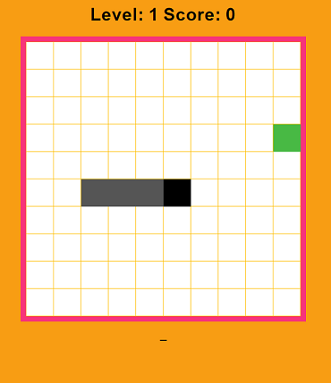

Had sa ovláda pomocou šípok. Po zozbieraní jedla sa dĺžka hada zväčší.
Po každom piatom pozbieranom jedle sa rýchlosť zvýši a postúpi sa do ďalšieho levelu.
Po narazení do vlastného chvosta hra končí.

